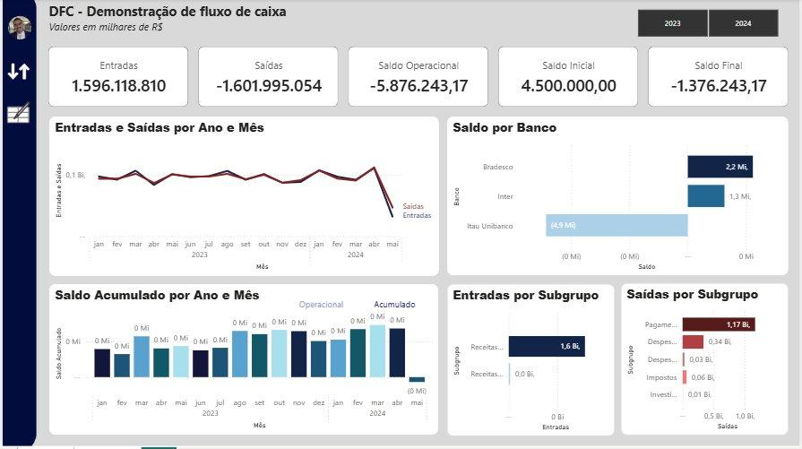
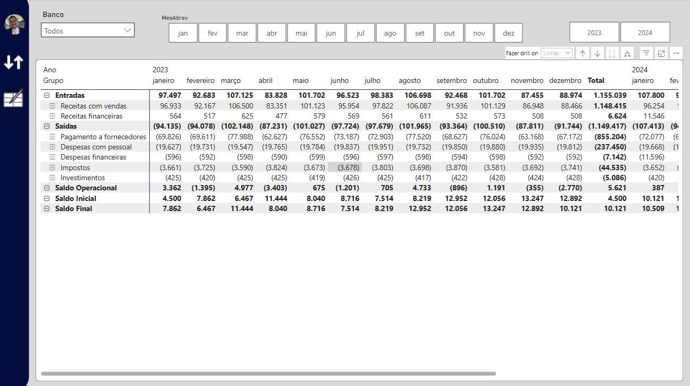
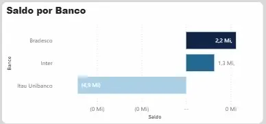
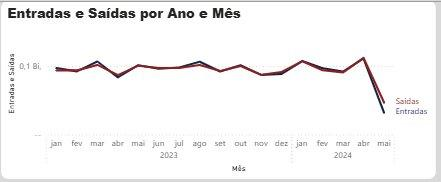
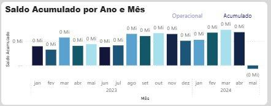
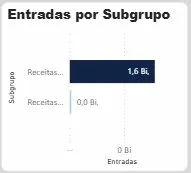
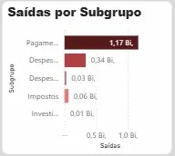

# Projeto Fluxo de Caixa

Power BI | Power Query | DAX | Git/GitHub | CSV´s
Autor: Otelmo Junior Borba  
Periodo dos dados: Janeiro/2023 a Maio/2024

## Preview do dashboard

Visao executiva principal da pagina DFC:



## Sumario

1. [Contexto de Negocio](#1-contexto-de-negocio)
2. [Motivacao e Escopo do Projeto](#2-motivacao-e-escopo-do-projeto)
3. [Construcao da Solucao](#3-construcao-da-solucao)
4. [Resultados e Valor para o Negocio](#4-resultados-e-valor-para-o-negocio)

## 1. Contexto de Negocio

O Fluxo de Caixa e o instrumento central da gestao financeira de qualquer organizacao. Ele registra, de forma cronologica, todos os recebimentos (entradas) e pagamentos (saidas) realizados em um determinado periodo, permitindo que gestores avaliem a saude financeira da empresa em tempo real.

Mais do que um simples relatorio de saldos, o fluxo de caixa e a base para:

- Analise de liquidez: a empresa consegue honrar compromissos nos proximos 30, 60, 90 dias?
- Identificacao de sazonalidade: em quais meses as receitas caem e as despesas sobem?
- Planejamento estrategico: ha caixa suficiente para investir, ou e necessario buscar capital de giro?
- Prevencao de crises: antecipar cenarios de insolvencia antes que eles se concretizem.

### 1.1 Origem e geracao dos dados

Os dados do fluxo de caixa sao produzidos a partir das operacoes financeiras do dia a dia da empresa: recebimentos de clientes, pagamentos a fornecedores, folha de pagamento, tributos, despesas bancarias e movimentacoes entre contas. Cada transacao e registrada com data, valor, banco, tipo (entrada ou saida) e classificacao contabil.

### 1.2 Fontes de dados utilizadas

Neste projeto, as informacoes foram extraidas de planilhas que simulam dados financeiros reais de uma empresa de medio porte industrial. No repositorio atual, essas bases estao disponibilizadas em formato CSV na pasta `dados_brutos/`.

| Fonte | Descricao |
| --- | --- |
| Movimentos | Registro detalhado de cada transacao financeira |
| PlanoContas | Classificacao hierarquica das contas (Grupo -> Subgrupo -> Conta) |
| Bancos | Cadastro das instituicoes financeiras utilizadas |
| SaldoAnterior | Saldo de abertura de cada banco no inicio do periodo |
| Modelo | Estrutura hierarquica do fluxo de caixa |

### 1.3 Publico consumidor das informacoes

| Perfil | Como utiliza |
| --- | --- |
| Diretor Financeiro / CFO | Visao consolidada de caixa para decisoes de investimento e financiamento |
| Controller | Acompanhamento de desvios entre realizado e planejado |
| Analista Financeiro | Detalhamento por banco, conta e periodo para conciliacao |
| Gestor de Negocio | Identificacao de tendencias e sazonalidades para planejamento comercial |

### 1.4 Logica de calculo do Fluxo de Caixa

A formula fundamental que sustenta toda a analise e:

```text
Saldo Final = Saldo Inicial + Entradas - Saidas
```

A partir dessa estrutura, derivamos:

| Indicador | Formula |
| --- | --- |
| Saldo Operacional | Entradas - Saidas (no periodo filtrado) |
| Saldo Inicial | Saldo acumulado anterior ao periodo + saldo de abertura dos bancos |
| Saldo Final | Saldo Inicial + Saldo Operacional |

Essa logica permite analises por periodo (mes, trimestre, ano), por banco e por categoria contabil, oferecendo diferentes camadas de profundidade ao gestor.

## 2. Motivacao e Escopo do Projeto

### 2.1 Por que este projeto existe

Muitas empresas de pequeno e medio porte ainda controlam seu fluxo de caixa em planilhas manuais. Esse cenario gera:

- Erros de digitacao e formula que comprometem a confiabilidade dos numeros
- Retrabalho mensal para consolidar dados de diferentes bancos e categorias
- Falta de visibilidade em tempo real; o gestor so descobre o problema quando ja e tarde
- Dificuldade de analise historica; comparar meses e anos exige manipulacao manual extensa

### 2.2 O que sera entregue

Uma solucao completa de Business Intelligence que:

- Centraliza dados de multiplas fontes em um modelo dimensional unico
- Automatiza o calculo de saldos, entradas, saidas e indicadores derivados
- Visualiza o desempenho financeiro em dashboards interativos com filtros por ano, mes e banco
- Gera insights acionaveis, nao apenas numeros, mas recomendacoes de negocio

### 2.3 Stack tecnologica

| Ferramenta | Finalidade |
| --- | --- |
| Power BI Desktop | Modelagem de dados, criacao de medidas DAX e desenvolvimento dos dashboards |
| Power Query (M) | Ingestao e transformacao dos dados brutos |
| DAX | Linguagem de medidas e calculos analiticos |
| Git & GitHub | Versionamento do projeto e documentacao |
| VS Code | Edicao de scripts auxiliares e documentacao Markdown |

## 3. Construcao da Solucao

### 3.1 Visao geral da arquitetura

| Camada | Componente | Descricao |
| --- | --- | --- |
| Fonte de Dados | Arquivos tabulares | Bancos, PlanoContas, Movimentos, SaldoAnterior, Modelo |
| ETL | Power Query (M) | Tipagem, limpeza, normalizacao e criacao de chaves IDs |
| Modelo | Star Schema | dim_bancos, dim_contas, dim_grupos, dim_calendario, f_movimentos, f_saldo_anterior |
| Dataviz | Power BI Dashboards | Pagina Matriz (analitica) e Pagina DFC (executiva) |

### 3.2 Datasets do projeto

O projeto e composto por 5 datasets de entrada:

| # | Arquivo | Tipo | Registros | Descricao |
| --- | --- | --- | --- | --- |
| 1 | Bancos.csv | Dimensao | 3 | Cadastro dos bancos (Itau Unibanco, Bradesco, Inter) |
| 2 | PlanoContas.csv | Dimensao | 27 | Hierarquia contabil: Subgrupo -> Conta |
| 3 | Movimentos.csv | Fato | ~14.900 | Transacoes financeiras com tipo, conta, data, banco e valor |
| 4 | SaldoAnterior.csv | Apoio | 3 | Saldo de abertura por banco |
| 5 | Modelo.csv | Dimensao | 5 | Estrutura hierarquica do fluxo de caixa (Entradas, Saidas, Saldos) |

### 3.3 Ingestao de dados no Power BI

As 5 tabelas foram importadas via Power Query e renomeadas seguindo a convencao de modelagem dimensional:

| Nome Original | Nome no Modelo | Tipo |
| --- | --- | --- |
| Bancos | dim_bancos | Dimensao |
| PlanoContas | dim_contas | Dimensao |
| Modelo | dim_grupos | Dimensao |
| Movimentos | f_movimentos | Fato |
| SaldoAnterior | f_saldo_anterior | Fato/Apoio |

Adicionalmente, foi criada a tabela `dim_calendario` diretamente em DAX para suportar analises de inteligencia temporal.

### 3.4 Tratamento de dados (Power Query)

#### 3.4.1 dim_bancos e dim_contas

Nao foram necessarias transformacoes; os dados ja estavam limpos e estruturados.

#### 3.4.2 f_movimentos (Tabela Fato)

| Etapa | Transformacao | Justificativa de Negocio |
| --- | --- | --- |
| 1 | Mesclagem de consultas para inserir `Conta_ID` e `Banco_ID` | Substituir chaves textuais por IDs numericos melhora performance e segue boas praticas de modelagem dimensional |
| 2 | Renomeacao das colunas inseridas | Padronizar nomenclatura para facilitar manutencao |
| 3 | Remocao das colunas textuais `Conta` e `Banco` | Evitar redundancia; os nomes descritivos vem das dimensoes via relacionamento |
| 4 | Coluna `Tipo`: extrair apenas o primeiro caractere (`E` / `S`) | Dados mais limpos e compactos, sem perda semantica |
| 5 | Coluna `Valor`: tipo alterado para Numero Decimal Fixo | Em dados financeiros, precisao absoluta e obrigatoria; ate os centavos importam |
| 6 | Codificacao UTF-8 verificada | Garantir leitura correta de acentos |

#### 3.4.3 f_saldo_anterior

- Coluna `Valor` convertida para Numero Decimal Fixo
- Limpeza do formato monetario textual para numero

#### 3.4.4 Criacao da dim_calendario (DAX)

A tabela de datas foi gerada via `CALENDAR` + `ADDCOLUMNS`, cobrindo o intervalo completo dos dados:

```dax
dim_calendario =
ADDCOLUMNS(
    CALENDAR(DATE(2023, 1, 1), DATE(2024, 12, 31)),
    "Ano", YEAR([Date]),
    "MesNumero", MONTH([Date]),
    "MesNome", FORMAT([Date], "MMMM"),
    "MesAbrev", FORMAT([Date], "MMM"),
    "Trimestre", "T" & FORMAT([Date], "Q"),
    "AnoMes", FORMAT([Date], "YYYY-MM")
)
```

Ajustes pos-criacao:

- Tabela marcada como tabela de data no Power BI
- Formato de data curto aplicado em todas as colunas de data
- Colunas `MesNome` e `MesAbrev` classificadas por `MesNumero`
- Em `dim_contas`: coluna `Conta` classificada por `Conta_ID` e `Subgrupo` classificada por `Subgrupo_ID`

### 3.5 Modelagem Dimensional (Star Schema)

O modelo segue o padrao Estrela (Star Schema), com a tabela fato `f_movimentos` no centro e as dimensoes ao redor.

Relacionamentos:

| Origem | Destino | Cardinalidade | Chave |
| --- | --- | --- | --- |
| dim_bancos | f_movimentos | 1:N | Banco_ID |
| dim_contas | f_movimentos | 1:N | Conta_ID |
| dim_calendario | f_movimentos | 1:N | Data / Date |
| dim_bancos | f_saldo_anterior | 1:N | Banco_ID |
| dim_grupos | Medida Fluxo | Logica dinamica | `SELECTEDVALUE(dim_grupos[Grupo_ID])` |

### 3.6 Dicionario de Dados

#### dim_bancos

| Campo | Tipo | Descricao |
| --- | --- | --- |
| Banco_ID | Inteiro | Chave primaria: identificador unico do banco |
| Banco | Texto | Nome da instituicao financeira |

#### dim_contas

| Campo | Tipo | Descricao |
| --- | --- | --- |
| Subgrupo_ID | Inteiro | ID do subgrupo contabil |
| Subgrupo | Texto | Nome do subgrupo (ex.: Receitas com vendas, Pagamento a fornecedores) |
| Conta_ID | Inteiro | Chave primaria: identificador unico da conta |
| Conta | Texto | Nome descritivo da conta (ex.: Vendas de produtos, Salarios) |

#### dim_calendario

| Campo | Tipo | Descricao |
| --- | --- | --- |
| Date | Data | Chave primaria: data do calendario |
| Ano | Inteiro | Ano extraido |
| MesNumero | Inteiro | Numero do mes (1-12) |
| MesNome | Texto | Nome completo do mes |
| MesAbrev | Texto | Abreviacao do mes |
| Trimestre | Texto | Trimestre formatado (T1, T2, T3, T4) |
| AnoMes | Texto | Ano-Mes no formato `YYYY-MM` |

#### f_movimentos

| Campo | Tipo | Descricao |
| --- | --- | --- |
| Data | Data | Data da transacao -> FK para `dim_calendario[Date]` |
| Banco_ID | Inteiro | FK -> `dim_bancos[Banco_ID]` |
| Conta_ID | Inteiro | FK -> `dim_contas[Conta_ID]` |
| Tipo | Texto | `E` (Entradas) ou `S` (Saidas) |
| Valor | Decimal Fixo | Valor monetario |

#### f_saldo_anterior

| Campo | Tipo | Descricao |
| --- | --- | --- |
| Banco_ID | Inteiro | FK -> `dim_bancos[Banco_ID]` |
| Valor | Decimal Fixo | Saldo de abertura do banco no inicio do periodo |

#### dim_grupos

| Campo | Tipo | Descricao |
| --- | --- | --- |
| Grupo_ID | Inteiro | Chave primaria: identificador do grupo (1 a 5) |
| Grupo | Texto | Nome do grupo no fluxo de caixa |

Mapeamento dos grupos:

| Grupo_ID | Grupo |
| --- | --- |
| 1 | Entradas |
| 2 | Saidas |
| 3 | Saldo Operacional |
| 4 | Saldo Inicial |
| 5 | Saldo Final |

### 3.7 Mapeamento de Indicadores

Antes da implementacao tecnica das medidas DAX, foi conduzido um processo de mapeamento de indicadores para garantir que cada calculo desenvolvido tivesse rastreabilidade de negocio clara e justificada.

A metodologia adotada estruturou-se em cinco dimensoes para cada indicador:

- Usuario chave: quem consome o indicador no dia a dia e orienta as decisoes com base nele
- Principal indicador: a metrica central que o usuario precisa visualizar para monitorar o processo sob sua responsabilidade
- Entendimento do processo: descricao do processo de negocio que o indicador representa e monitora
- Identificacao dos dados: fontes e campos da camada semantica que alimentam o calculo
- Racional de calculo: logica de transformacao dos dados brutos no indicador final esperado pelo usuario

| Usuario Chave | Principal Indicador | Entendimento do Processo | Dados Utilizados | Racional de Calculo |
| --- | --- | --- | --- | --- |
| Gestor Financeiro | Saldo Final | Posicao de caixa ao final de cada periodo analisado, combinando historico acumulado e resultado corrente | `f_movimentos[Valor]`, `f_saldo_anterior[Valor]` | Saldo Inicial somado ao Saldo Operacional do periodo |
| Controller | Saldo Inicial | Ponto de partida da analise, consolidando o acumulado anterior e o saldo de abertura bancaria | `f_movimentos[Valor]`, `f_saldo_anterior[Valor]` | `CALCULATE` acumulado anterior ao menor `Date` do filtro, acrescido do saldo anterior cadastrado |
| Analista Financeiro | Entradas | Monitoramento dos recebimentos do periodo, incluindo vendas, receitas financeiras e transferencias de entrada | `f_movimentos[Valor]` filtrado por `Tipo = "E"` | `SUM` sobre movimentos classificados como entrada |
| Analista Financeiro | Saidas | Controle dos pagamentos e despesas realizados no periodo | `f_movimentos[Valor]` filtrado por `Tipo = "S"` | `SUM` sobre movimentos classificados como saida |
| Controller | Saldo Operacional | Resultado liquido do periodo, termometro imediato da saude financeira da operacao | `f_movimentos[Valor]` | Soma de entradas positivas e saidas negativas no periodo |
| Analista de BI | Fluxo (Dinamica) | Exibicao hierarquica e contextual dos indicadores no visual de matriz, sem necessidade de multiplos relatorios | `dim_grupos[Grupo_ID]` | `SWITCH` dinamico por `Grupo_ID`, retornando a medida correspondente a cada linha da hierarquia |

Esse mapeamento previo foi determinante para garantir coesao entre a camada de negocio e a implementacao tecnica, evitando retrabalho e reduzindo ambiguidade na interpretacao dos indicadores.

### 3.7.1 Indicadores e Medidas DAX

Mapeamento dos principais indicadores e usuarios chave que resultaram nas medidas DAX.

#### Medida: Entradas

```dax
Entradas =
    CALCULATE(
        SUM(f_movimentos[Valor]),
        f_movimentos[Tipo] = "E"
    )
```

O que calcula: soma de todos os recebimentos (vendas, receitas financeiras, transferencias de entrada).  
Valor de negocio: permite monitorar a capacidade de geracao de receita da empresa e identificar meses de baixo desempenho comercial.

#### Medida: Saidas

```dax
Saidas =
    CALCULATE(
        SUM(f_movimentos[Valor]),
        f_movimentos[Tipo] = "S"
    )
```

O que calcula: soma de todos os pagamentos e despesas realizados.  
Valor de negocio: controle rigoroso dos custos operacionais, essencial para identificar categorias que consomem mais caixa.

#### Medida: Saidas ABS

```dax
Saidas ABS = ABS([Saidas])
```

O que calcula: valor absoluto das saidas, convertendo o sinal negativo para positivo.  
Valor de negocio: padroniza a exibicao nos cards e graficos, facilitando a comparacao direta com as entradas.

#### Medida: Saldo Operacional

```dax
Saldo Operacional = SUM(f_movimentos[Valor])
```

O que calcula: resultado liquido do periodo, soma de entradas positivas e saidas negativas.  
Valor de negocio: indica se a operacao gerou superavit ou deficit de caixa; e o termometro imediato da saude financeira.

#### Medida: Saldo Inicial

```dax
Saldo Inicial =
    CALCULATE(
        SUM(f_movimentos[Valor]),
        dim_calendario[Date] < MIN(dim_calendario[Date])
    ) + SUM(f_saldo_anterior[Valor])
```

O que calcula: saldo acumulado anterior ao periodo selecionado, acrescido do saldo de abertura dos bancos.  
Valor de negocio: define o ponto de partida da analise; sem ele, e impossivel calcular o saldo final correto.

#### Medida: Saldo Final

```dax
Saldo Final = [Saldo Inicial] + [Saldo Operacional]
```

O que calcula: posicao financeira ao final do periodo analisado.  
Valor de negocio: e o indicador-mestre do projeto; responde a pergunta: "Quanto dinheiro a empresa tem ao final deste mes?"

#### Medida: Fluxo (Dinamica)

```dax
Fluxo =
VAR __GrupoID = SELECTEDVALUE(dim_grupos[Grupo_ID])
RETURN
    IF(
        __GrupoID IN {3, 4, 5} &&
            ISINSCOPE(dim_contas[Subgrupo]),
        BLANK(),
        SWITCH(
            SELECTEDVALUE(dim_grupos[Grupo_ID]),
            1, [Entradas],
            2, [Saidas],
            3, [Saldo Operacional],
            4, [Saldo Inicial],
            5, [Saldo Final]
        )
    )
```

O que calcula: retorna dinamicamente o valor correto conforme o grupo selecionado na visualizacao de matriz.  
Valor de negocio: permite exibir entradas, saidas e saldos em uma unica tabela hierarquica, eliminando a necessidade de multiplos relatorios separados.

### 3.8 Dashboards e Visualizacoes

O projeto conta com 2 paginas de dashboard, cada uma com proposito especifico. A seguir, apresentamos cada pagina e seus graficos com analise detalhada de negocio.

#### Galeria visual

Pagina DFC:


Pagina Matriz:



Saldo por banco:



Entradas e saidas por periodo:



Saldo acumulado por periodo:



Entradas por subgrupo:



Saidas por subgrupo:



#### 3.8.1 Pagina "Matriz": visao analitica detalhada

Visuais incluidos:

- Segmentacao de dados por Banco, Mes e Ano
- Matriz hierarquica com a medida `Fluxo`, exibindo Grupo -> Subgrupo -> Conta por periodo

Medida utilizada: `Fluxo`  
Colunas utilizadas: `dim_grupos[Grupo]`, `dim_contas[Conta]`, `dim_contas[Subgrupo]`, `dim_calendario[Ano]` e `dim_calendario[MesNome]`

Para que serve: permite ao analista ou controller realizar drill-down completo nas categorias contabeis, identificando exatamente onde o dinheiro entra e sai, mes a mes.

Principais descobertas (2023-2024):

- O saldo operacional consolidado do bienio ficou negativo em R$ 5,87 milhoes, sinalizando que as saidas superaram as entradas no acumulado
- 2023 fechou positivo (R$ 5,62 mi), porem 2024 reverteu o cenario com deficit de R$ 11,49 mi
- Pagamentos a fornecedores e despesas com pessoal continuam sendo as maiores pressoes de saida
- Maio/2024 apresentou queda abrupta, com entradas e saidas muito abaixo da media

Recomendacoes:

- Renegociar prazos e condicoes com fornecedores principais
- Investigar a causa da queda de receitas em fev-mar/2024
- Usar 2023 como base para definir metas de eficiencia operacional

#### 3.8.2 Pagina "DFC": visao executiva com graficos

A pagina DFC apresenta uma visao consolidada com cards de Big Numbers e 5 graficos analiticos:

- Cards: Entradas, Saidas, Saldo Operacional, Saldo Inicial, Saldo Final
- Segmentacao: filtro por Ano (2023, 2024)

##### Grafico 01: Entradas e Saidas por Ano e Mes

| Especificacao | Detalhe |
| --- | --- |
| Tipo Visual | Grafico de Linhas |
| Medidas | `Entradas`, `Saidas ABS` |
| Colunas | `dim_calendario[Ano]`, `dim_calendario[MesAbrev]` |

Dashboard Overview: o grafico compara Entradas (receitas) e Saidas (despesas) mes a mes nos anos de 2023 e 2024. As duas linhas se mantem muito proximas, mostrando que a empresa opera com margens apertadas entre o que entra e o que sai do caixa. Alguns meses apresentam picos de entradas e saidas, mostrando sazonalidade, especialmente em marco, agosto e outubro de 2023 e abril de 2024.

| Situacao | Insight | Recomendacoes |
| --- | --- | --- |
| Margem apertada entre entrada e saida | A empresa opera proxima do ponto de equilibrio financeiro | Criar reserva de caixa, renegociar despesas fixas e automatizar controle de custos |
| Picos de entradas em meses especificos | Indica sazonalidade ou eventos especificos de faturamento | Planejar caixa para periodos de baixa e antecipar compras ou investimentos nos meses de alta |
| Queda em maio/2024 | Pode ser impacto de mercado, atraso em recebiveis ou aumento de custos | Verificar causas, acelerar recebimentos e revisar contratos com fornecedores |
| Estabilidade em 2024 | Menos volatilidade, porem com menor folga de saldo operacional | Manter controle rigido, mas buscar aumento de receita (novos clientes, reajustes de precos) |

##### Grafico 02: Saldo Acumulado por Ano e Mes

| Especificacao | Detalhe |
| --- | --- |
| Tipo Visual | Grafico de Colunas Clusterizadas |
| Medidas | `Saldo Final` |
| Colunas | `dim_calendario[Ano]`, `dim_calendario[MesAbrev]`, `dim_bancos[Banco]` |

Dashboard Overview: o saldo acumulado representa a soma dos resultados mensais ao longo do tempo, indicando se a empresa esta aumentando ou reduzindo seu caixa total. Em 2023, observa-se crescimento continuo do saldo ao longo dos meses, especialmente de agosto a novembro. Em 2024, o saldo inicia positivo, cresce entre janeiro e marco, mas apresenta forte queda em abril e praticamente zera em maio.

| Situacao | Insight | Recomendacoes |
| --- | --- | --- |
| Crescimento constante do saldo em 2023 (principalmente de agosto a novembro) | Boa capacidade de geracao de caixa e controle das despesas no periodo | Manter o controle de gastos e replicar as estrategias desse periodo em 2024 |
| Queda do saldo em meses iniciais de 2023 (fevereiro/marco) | Entradas menores ou aumento de despesas impactaram temporariamente o caixa | Monitorar sazonalidade e planejar reservas para meses de menor receita |
| Crescimento do saldo de janeiro a marco de 2024 | Fluxo positivo inicial indica equilibrio entre entradas e saidas | Reforcar as praticas de controle de despesas e estimular receitas recorrentes |
| Forte reducao em abril e saldo quase zerado em maio de 2024 | Aumento de despesas ou queda nas entradas comprometeu o caixa | Revisar despesas dos meses criticos, renegociar pagamentos e fortalecer receitas fixas |
| Falta de continuidade no crescimento do saldo em 2024 | Perda de consistencia financeira em comparacao com 2023 | Criar plano de contingencia, ajustar orcamento e acompanhar o fluxo de caixa com maior frequencia |

##### Grafico 03: Saldo por Banco

| Especificacao | Detalhe |
| --- | --- |
| Tipo Visual | Grafico de Barras Horizontais |
| Medidas | `Saldo Final` |
| Colunas | `dim_bancos[Banco]` |

Dashboard Overview: o grafico mostra o saldo consolidado por banco. Bradesco e Inter apresentam saldos positivos (R$ 2,2 mi e R$ 1,3 mi, respectivamente), enquanto Itau Unibanco apresenta saldo negativo expressivo (R$ -4,9 mi). Isso indica concentracao de recursos em poucos bancos e possivel desequilibrio ou uso excessivo de uma conta especifica.

| Situacao | Insight | Recomendacoes |
| --- | --- | --- |
| Bradesco com maior saldo positivo em ambos os anos | Demonstra boa gestao e estabilidade financeira nesse banco | Manter alocacao, mas avaliar se parte do saldo pode ser investida com melhor rentabilidade |
| Inter com saldo positivo, porem menor e em queda em 2024 | Reducao pode indicar saques ou baixa entrada de recursos | Reforcar entradas via Inter ou analisar possiveis custos bancarios e tarifas |
| Itau Unibanco com saldo negativo nos dois anos | Uso excessivo da conta, possivel endividamento ou fluxo negativo recorrente | Revisar operacoes vinculadas a esse banco, renegociar tarifas, limites ou transferir obrigacoes para bancos com saldo positivo |
| Concentracao de caixa em poucos bancos | A distribuicao desigual pode representar risco financeiro e operacional | Distribuir saldos de forma mais equilibrada entre instituicoes para reduzir risco e aproveitar melhores condicoes |

##### Grafico 04: Entradas por Subgrupo

| Especificacao | Detalhe |
| --- | --- |
| Tipo Visual | Grafico de Barras Horizontais |
| Medidas | `Entradas` |
| Colunas | `dim_contas[Subgrupo]` |

Dashboard Overview: os graficos mostram a composicao das entradas por subgrupo. Em ambos os anos, a grande maioria das entradas vem de "Receitas com vendas" (R$ 1,6 bi), enquanto as receitas financeiras representam uma parcela muito pequena do total.

| Situacao | Insight | Recomendacoes |
| --- | --- | --- |
| Receita concentrada em vendas | Mais de 95% das entradas vem de "Receitas com vendas"; ha forte dependencia desse subgrupo | Diversificar fontes de receita, reforcar estrategias de fidelizacao e expansao de clientes |
| Baixa participacao das receitas financeiras | As receitas financeiras representam uma parcela pouco significativa do total | Avaliar oportunidades de aplicacoes financeiras mais rentaveis ou melhorar gestao de caixa |
| Entrada consistente via vendas | As vendas se mantem como principal motor de entrada nos dois anos analisados | Manter estrategias comerciais eficazes, ampliar canais de venda e monitorar indicadores de desempenho |
| Potencial subaproveitamento de receitas financeiras | O resultado financeiro e baixo frente ao volume de caixa disponivel | Analisar politicas de aplicacao financeira e rendimentos |

##### Grafico 05: Saidas por Subgrupo

| Especificacao | Detalhe |
| --- | --- |
| Tipo Visual | Grafico de Barras Horizontais |
| Medidas | `Saidas ABS` |
| Colunas | `dim_contas[Subgrupo]` |

Dashboard Overview: os graficos mostram a distribuicao das despesas por subgrupo. Em ambos os anos, os maiores gastos estao concentrados em Pagamento a fornecedores (R$ 1,17 bi), seguidos por Despesas com pessoal (R$ 0,34 bi). Os demais subgrupos, como despesas financeiras, impostos e investimentos, representam parcelas menores do total de saidas.

| Situacao | Insight | Recomendacoes |
| --- | --- | --- |
| Alto gasto com fornecedores em ambos os anos | Pagamentos a fornecedores representam a maior parte das despesas, porem houve reducao em 2024 | Continuar negociacao de contratos, buscar alternativas de fornecedores e manter o controle de custos |
| Reducao nas despesas com pessoal em 2024 | Queda significativa nos gastos com pessoal indica otimizacao de recursos ou reducao de quadro | Garantir que a reducao nao impacte a produtividade; manter a eficiencia com monitoramento continuo |
| Aumento das despesas financeiras em 2024 | Crescimento de juros ou contratacao de novos financiamentos elevou os gastos financeiros | Renegociar dividas, reduzir dependencia de credito e melhorar fluxo de caixa |
| Reducao no valor de impostos em 2024 | Menor pagamento de impostos pode estar ligado a queda de receita ou incentivos fiscais | Avaliar manutencao de incentivos e assegurar conformidade tributaria |
| Baixo nivel de investimentos | Investimentos sao baixos em ambos os anos e reduziram ainda mais em 2024 | Planejar investimentos estrategicos para nao comprometer o crescimento e a modernizacao |

#### 3.8.3 Navegacao entre paginas

Botoes de icone foram inseridos nos dashboards para permitir a navegacao rapida entre as paginas Matriz e DFC, proporcionando fluidez na experiencia do usuario.

## 4. Resultados e Valor para o Negocio

A construcao desta solucao de Fluxo de Caixa no Power BI entregou os seguintes resultados concretos:

| Resultado | Impacto |
| --- | --- |
| Centralizacao dos dados | Informacoes de 3 bancos, 27 contas e 5 grupos de fluxo consolidados em um unico modelo |
| Automacao dos calculos | Eliminacao de formulas manuais em Excel: saldo inicial, operacional e final calculados automaticamente |
| Reducao do tempo de analise | Dashboard atualizado instantaneamente com filtros interativos, versus horas de consolidacao manual |
| Padronizacao | Nomenclatura, tipagem e modelagem dimensional garantem consistencia e rastreabilidade |
| Insights acionaveis | Cada grafico acompanha analise de negocio e recomendacoes, nao apenas numeros |
| Escalabilidade | O modelo esta preparado para receber novas fontes (ERP, APIs bancarias) sem reestruturacao |

## Estrutura do repositorio

```text
analise-fluxo-caixa-powerbi/
|-- assets/
|   `-- img/
|       |-- image1.png
|       |-- image2.jpg
|       |-- image3.jpg
|       |-- image4.png
|       |-- image5.png
|       |-- image6.jpg
|       `-- image7.jpg
|-- dados_brutos/
|   |-- Bancos.csv
|   |-- Modelo.csv
|   |-- Movimentos.csv
|   |-- PlanoContas.csv
|   `-- SaldoAnterior.csv
|-- documentacao-fluxo-caixa.docx
|-- fluxo-caixa.pbix
`-- README.md
```

## Como explorar este projeto

1. Abra o arquivo `fluxo-caixa.pbix` no Power BI Desktop.
2. Valide os caminhos de origem dos arquivos em `dados_brutos/`, caso necessario.
3. Atualize o modelo para recarregar os dados.
4. Navegue entre as paginas `Matriz` e `DFC` para analisar a visao analitica e a visao executiva.
